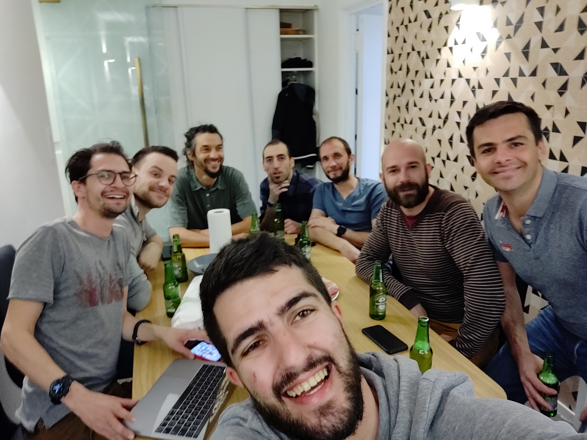
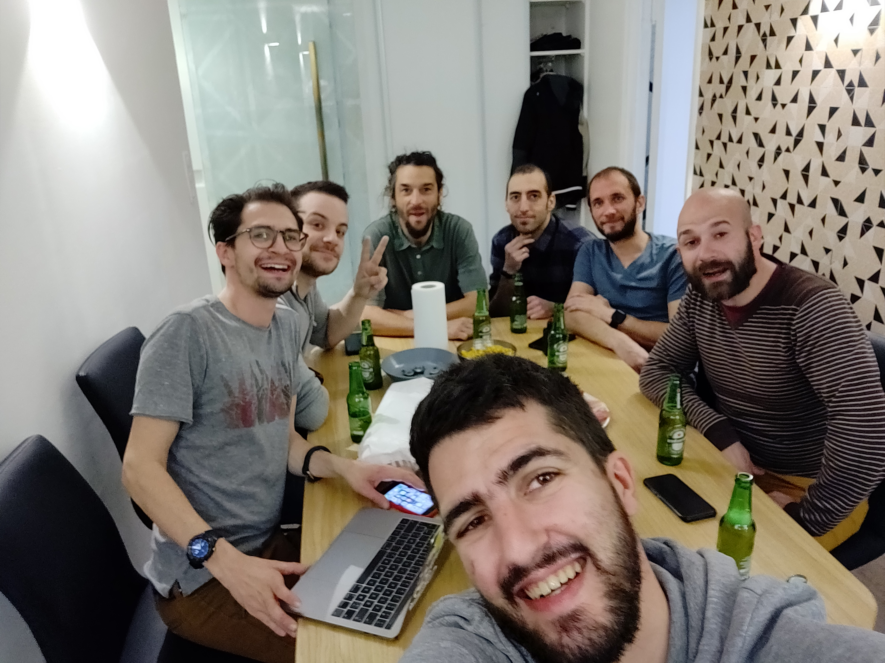

# TA 2019-03-12

## Loaction
@PG3

## LINK
* https://github.com/ipfs/ipfs
* https://fr.wikipedia.org/wiki/InterPlanetary_File_System
* https://github.com/browsh-org/browsh : Mieux que Lynx
* https://brave.com/features/ : Browser avec AddBlock
* https://www.urbackup.org/ : Solution de Backup de Antho (+ branch git ^^)
* https://www.minio.io/ : S3 Selfhosting
* https://storageos.com/ : Solutiion de storage en cours de tester par Romain
* https://storj.io/ : A étudier 

## PIC

