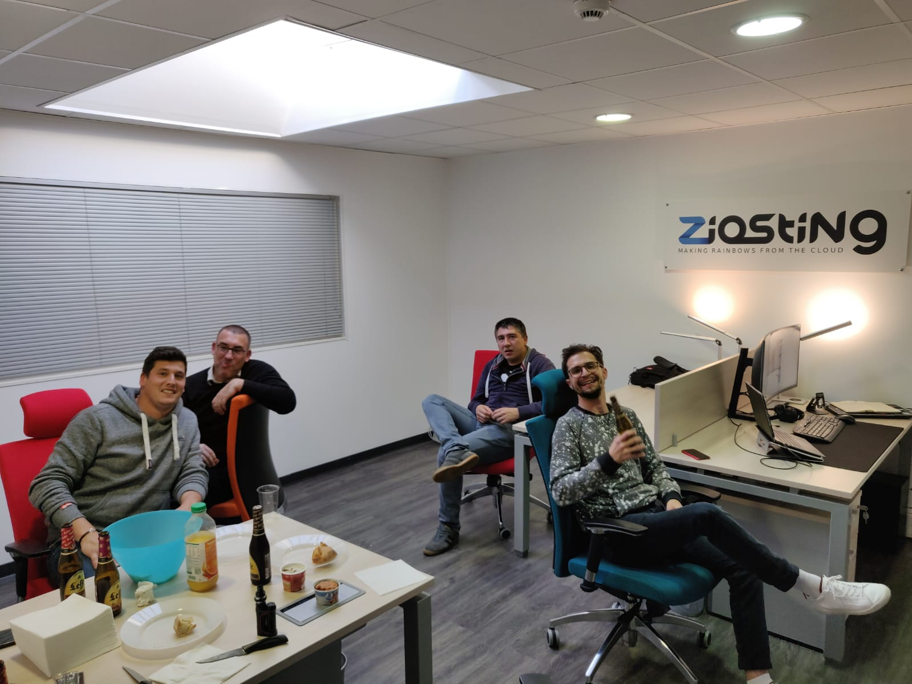

**TA 2019-04-24**

# Location
@Ziosting (1er etage Bât 1, 225 Avenue de Saint-Exupéry, 06210 Mandelieu-la-Napoule, [maps])

Merci pour les bières Romain !

# LINK 
* https://www.wireguard.com/ :  VPN New Generation
* https://github.com/subspacecloud/subspace : UI Wireguard
* https://github.com/containrrr/watchtower : Watchtower is an application that will monitor your running Docker containers and watch for changes to the images 
* https://glpi-project.org/fr/ : Révélation de la soirée ... C'est beau maintenant !!
* https://sensu.io/ : A simple, malleable, and scalable framework for composing the monitoring system you need (https://github.com/sensu/sensu)
* https://cloud.google.com/anthos/ : Solution d'hybride cloud de Google pour délpoyer du kub sur un environnement hétérogène (multi cloud)
* https://blog.containo.us/back-to-traefik-2-0-2f9aa17be305 : alpha 2.0 de traefik, qui supporte le TCP (Traefik est un reverse proxy docker uniquement http/https actuellement)
* https://docs.traefik.io/v2.0/ : Doc Traefik Alpha 2.0

# PIC

[maps]:https://goo.gl/maps/LCyZX6JkfcnE6pwb7
